

<a href="https://rakan-a-alnusayri.github.io/portfolio/"><picture><source media="(prefers-color-scheme: dark)" srcset="./assets/hero-dark.svg"></picture></a>

<h2> About Me · نبذة عني</h2>

<blockquote>
<i>"Turning data into insight, and insight into action."</i>
</blockquote>

I'm <b>Rakan Alnusayri</b> — a <b>Computer Science graduate</b> based in <b>Riyadh, Saudi Arabia</b> 🇸🇦, focused on <b>data analysis</b> and <b>machine learning</b>.

I work at the intersection of <b>data analysis</b>, <b>data science</b>, and <b>machine learning</b> — turning messy, real-world data into clear decisions with <b>SQL</b>, <b>Python</b>, and <b>Power BI</b>, and taking it further with <b>machine-learning models</b> that solve practical problems.

 

<h2> Technology Stack</h2>

<a href="https://www.python.org/"><picture><source media="(prefers-color-scheme: dark)" srcset="./assets/t-python-dark.svg">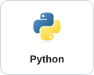</picture></a>
<a href="https://pandas.pydata.org/"><picture><source media="(prefers-color-scheme: dark)" srcset="./assets/t-pandas-dark.svg">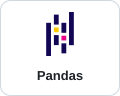</picture></a>
<a href="https://numpy.org/"><picture><source media="(prefers-color-scheme: dark)" srcset="./assets/t-numpy-dark.svg">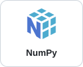</picture></a>
<a href="https://en.wikipedia.org/wiki/SQL"><picture><source media="(prefers-color-scheme: dark)" srcset="./assets/t-sql-dark.svg">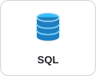</picture></a>
<a href="https://scikit-learn.org/"><picture><source media="(prefers-color-scheme: dark)" srcset="./assets/t-scikitlearn-dark.svg">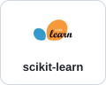</picture></a>
<a href="https://matplotlib.org/"><picture><source media="(prefers-color-scheme: dark)" srcset="./assets/t-matplotlib-dark.svg">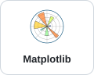</picture></a>
<a href="https://seaborn.pydata.org/"><picture><source media="(prefers-color-scheme: dark)" srcset="./assets/t-seaborn-dark.svg">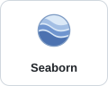</picture></a>
<a href="https://www.microsoft.com/power-platform/products/power-bi"><picture><source media="(prefers-color-scheme: dark)" srcset="./assets/t-powerbi-dark.svg">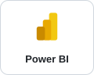</picture></a>
<a href="https://git-scm.com/"><picture><source media="(prefers-color-scheme: dark)" srcset="./assets/t-git-dark.svg">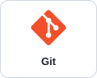</picture></a>
<a href="https://github.com/RAKAN-A-ALNUSAYRI"><picture><source media="(prefers-color-scheme: dark)" srcset="./assets/t-github-dark.svg">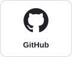</picture></a>
<a href="https://jupyter.org/"><picture><source media="(prefers-color-scheme: dark)" srcset="./assets/t-jupyter-dark.svg">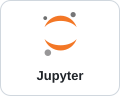</picture></a>
<a href="https://fastapi.tiangolo.com/"><picture><source media="(prefers-color-scheme: dark)" srcset="./assets/t-fastapi-dark.svg">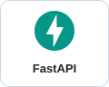</picture></a>

<h2> Featured Projects &nbsp;<a href="https://github.com/RAKAN-A-ALNUSAYRI/data-analysis-projects">View all repositories →</a></h2>

<h3> <a href="https://github.com/RAKAN-A-ALNUSAYRI/data-analysis-projects/tree/main/bike-sales-analysis">Bike Sales Analysis</a></h3>

A bike retailer's order history — 60,919 rows — cleaned in Excel and queried in SQL to answer one question: where does the money actually come from?

<b>$81.0M</b> revenue &nbsp;·&nbsp; <b>60,919</b> orders &nbsp;·&nbsp; <b>83%</b> of revenue from bikes

 

<a href="https://github.com/RAKAN-A-ALNUSAYRI/data-analysis-projects/tree/main/bike-sales-analysis"><b>View project →</b></a>

 

<h3> <a href="https://github.com/RAKAN-A-ALNUSAYRI/data-analysis-projects/tree/main/supply-chain-performance">Supply Chain Performance</a></h3>

5,000 orders across three suppliers and three years — tracing where the delays and the losses really come from, and whether one supplier is to blame.

<b>80.3%</b> on time &nbsp;·&nbsp; <b>$100.14</b> average freight &nbsp;·&nbsp; <b>3.61%</b> units damaged

 

<a href="https://github.com/RAKAN-A-ALNUSAYRI/data-analysis-projects/tree/main/supply-chain-performance"><b>View project →</b></a>

 

<h3> <a href="https://github.com/RAKAN-A-ALNUSAYRI/data-analysis-projects/tree/main/city-profitability-analysis">City Profitability</a></h3>

26,397 sales lines modelled on a five-dimension star schema to test a claim that sounds obvious: that the city selling the most is the city worth the most.

<b>$22.86M</b> revenue &nbsp;·&nbsp; <b>$9.92M</b> profit &nbsp;·&nbsp; <b>43.4%</b> overall margin

  

<a href="https://github.com/RAKAN-A-ALNUSAYRI/data-analysis-projects/tree/main/city-profitability-analysis"><b>View project →</b></a>

 

<h3> <a href="https://github.com/RAKAN-A-ALNUSAYRI/data-analysis-projects/tree/main/cookie-sales-analysis">Cookie Sales Report</a></h3>

A Power BI report on orders, products and customers for a wholesale bakery — and the customer-concentration risk hiding behind healthy margins.

<b>$4.69M</b> revenue &nbsp;·&nbsp; <b>57.9%</b> margin &nbsp;·&nbsp; <b>54%</b> of revenue from 2 of 5 buyers

  

<a href="https://github.com/RAKAN-A-ALNUSAYRI/data-analysis-projects/tree/main/cookie-sales-analysis"><b>View project →</b></a>

 

<h2> Recent Activity &nbsp;<a href="https://github.com/RAKAN-A-ALNUSAYRI?tab=overview">More activity on GitHub →</a></h2>

<picture>
  <source media="(prefers-color-scheme: dark)" srcset="./dist/github-contribution-grid-snake-dark.svg">
  
</picture>

<h2> Foundations &amp; Learning Repositories &nbsp;<a href="https://github.com/RAKAN-A-ALNUSAYRI?tab=repositories">See all →</a></h2>

 <a href="https://github.com/RAKAN-A-ALNUSAYRI/python-foundations"><b>python-foundations</b></a> &nbsp;<code>Public</code> Core Python programming concepts, exercises and practice projects

 <a href="https://github.com/RAKAN-A-ALNUSAYRI/data-science-foundations"><b>data-science-foundations</b></a> &nbsp;<code>Public</code> Data analysis, visualization and machine-learning foundations

 <a href="https://github.com/RAKAN-A-ALNUSAYRI/data-analysis-projects"><b>data-analysis-projects</b></a> &nbsp;<code>Public</code> Real-world data analysis projects, dashboards and case studies

 <a href="https://github.com/RAKAN-A-ALNUSAYRI/portfolio"><b>portfolio</b></a> &nbsp;<code>Public</code> Source code for my personal portfolio website

<h2> Let's Connect</h2>

I'm open to focused conversations around AI, data science, practical projects, and future opportunities.

<a href="https://www.linkedin.com/in/rakan-alnusayri-1100b72ab"><picture><source media="(prefers-color-scheme: dark)" srcset="./assets/c-linkedin-dark.svg">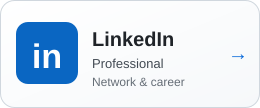</picture></a>
<a href="https://github.com/RAKAN-A-ALNUSAYRI"><picture><source media="(prefers-color-scheme: dark)" srcset="./assets/c-github-dark.svg">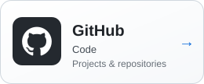</picture></a>
<a href="https://rakan-a-alnusayri.github.io/portfolio/"><picture><source media="(prefers-color-scheme: dark)" srcset="./assets/c-portfolio-dark.svg">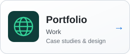</picture></a>
<a href="mailto:rakanalnsyry8@gmail.com"><picture><source media="(prefers-color-scheme: dark)" srcset="./assets/c-email-dark.svg"></picture></a>

Build · Learn · Share · Improve · Repeat 
📍 Riyadh, Saudi Arabia &nbsp;·&nbsp; Let's build a brighter tomorrow.

