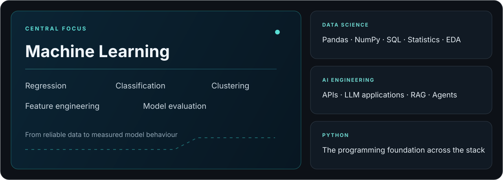
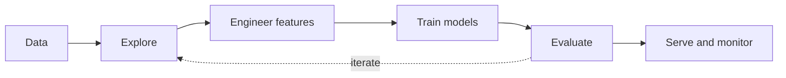

  

  Computer Science graduate in Riyadh building practical work across machine learning, data science, and AI engineering.

  <a href="https://github.com/RAKAN-A-ALNUSAYRI/portfolio">Portfolio</a>
  &nbsp;·&nbsp;
  <a href="https://www.linkedin.com/in/rakan-alnusayri-1100b72ab">LinkedIn</a>
  &nbsp;·&nbsp;
  <a href="https://github.com/RAKAN-A-ALNUSAYRI?tab=repositories">Repositories</a>

## Core focus

## Selected work

The consolidated collection covers sales, supply chain, profitability, and customer concentration analysis using real project artifacts: datasets, SQL queries, dashboards, models, and written findings.

> Major machine-learning and AI systems will be published as standalone repositories when they are complete enough to deserve an independent case study.

## Machine-learning workflow

## Engineering surface

| Machine Learning | Data Science | AI Engineering |
|:---|:---|:---|
| Regression · Classification · Clustering | Pandas · NumPy · SQL · Statistics · EDA | APIs · LLM applications · RAG · Agents |
| Feature engineering · Model evaluation | Data modelling · Reproducible analysis | Retrieval and application architecture |

Python is the core programming language supporting this work.

## GitHub activity

<strong>Foundations and supporting disciplines</strong>

### Foundations repositories

- [`python-foundations`](https://github.com/RAKAN-A-ALNUSAYRI/python-foundations) — exercises, challenges, and small programs that preserve the Python learning record.
- [`data-science-foundations`](https://github.com/RAKAN-A-ALNUSAYRI/data-science-foundations) — NumPy, Pandas, SQL, statistics, and machine-learning foundations.
- [`ai-engineering-foundations`](https://github.com/RAKAN-A-ALNUSAYRI/ai-engineering-foundations) — API integration, LLM applications, retrieval, and agent experiments as they are built.

### Networking

CCNA · Network fundamentals · Future network automation

Networking remains a complementary technical discipline. Its repository is maintained separately and is not modified by this profile project.

---

  Build evidence. Explain decisions. Improve the system.

