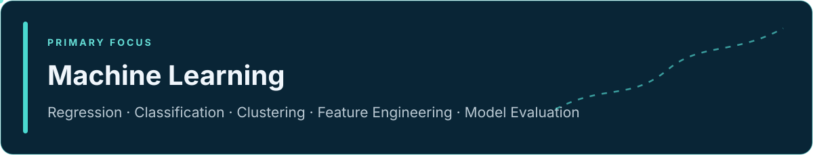
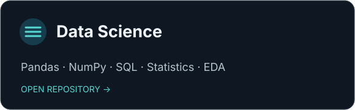
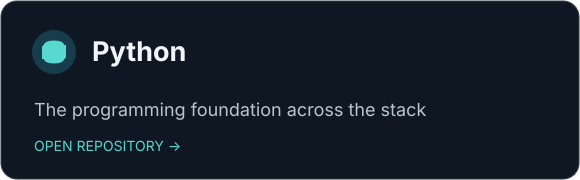
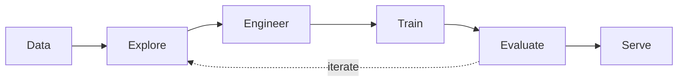

  

  Computer Science graduate in Riyadh building practical work around machine learning, data science, and Python.

  <a href="https://rakan-a-alnusayri.github.io/portfolio/">Portfolio</a>
  &nbsp;·&nbsp;
  <a href="https://www.linkedin.com/in/rakan-alnusayri-1100b72ab">LinkedIn</a>
  &nbsp;·&nbsp;
  <a href="https://github.com/RAKAN-A-ALNUSAYRI?tab=repositories">Repositories</a>

## Core focus

<table>
  <tr>
    <td width="50%"></td>
    <td width="50%"></td>
  </tr>
</table>

<strong>Machine Learning Toolkit</strong>

- Problem framing and baseline selection
- Regression, classification, and clustering
- Feature engineering and preprocessing
- Validation, model comparison, and evaluation
- Reproducibility and clear limitation reporting

<strong>Data Science Toolkit</strong>

- NumPy and Pandas for numerical and tabular work
- SQL for querying and analytical transformations
- Statistics and exploratory data analysis
- Data modelling, cleaning, and reproducible findings

## Selected work

| Project | Direct link |
|:---|:---|
| Bike Sales | [Open analysis →](https://github.com/RAKAN-A-ALNUSAYRI/data-analysis-projects/tree/main/bike-sales-analysis) |
| Supply Chain | [Open analysis →](https://github.com/RAKAN-A-ALNUSAYRI/data-analysis-projects/tree/main/supply-chain-performance) |
| City Profitability | [Open analysis →](https://github.com/RAKAN-A-ALNUSAYRI/data-analysis-projects/tree/main/city-profitability-analysis) |
| Cookie Sales | [Open analysis →](https://github.com/RAKAN-A-ALNUSAYRI/data-analysis-projects/tree/main/cookie-sales-analysis) |

Future standalone ML projects will be added here through live repository cards when the projects actually exist.

## Machine-learning workflow

This represents the working approach—not a claim that every stage has already been completed in a public project.

## Technical Direction

- Build reproducible machine-learning projects around clearly framed problems and defensible baselines.
- Strengthen the data foundation behind each model through thoughtful exploration, feature work, and evaluation.
- Turn selected work into reliable, documented applications when the project is ready to stand on its own.

## Technology ecosystem

| Foundation | Data work | Engineering practice |
|:---|:---|:---|
| Python | NumPy · Pandas | Git · GitHub |
| SQL | Statistics · EDA | Reproducible project structure |

Libraries are added only when public work demonstrates their use.

## Live activity

<picture>
  <source media="(prefers-color-scheme: dark)" srcset="./dist/github-contribution-grid-snake-dark.svg">
  <source media="(prefers-color-scheme: light)" srcset="./dist/github-contribution-grid-snake.svg">
  
</picture>

<strong>Foundations</strong>

- [`python-foundations`](https://github.com/RAKAN-A-ALNUSAYRI/python-foundations) — exercises, challenges, and small programs.
- [`data-science-foundations`](https://github.com/RAKAN-A-ALNUSAYRI/data-science-foundations) — NumPy, Pandas, SQL, statistics, and ML foundations.

<strong>Repository Guide</strong>

| Repository | Purpose |
|:---|:---|
| [`data-analysis-projects`](https://github.com/RAKAN-A-ALNUSAYRI/data-analysis-projects) | Consolidated analysis case studies and dashboards |
| [`python-foundations`](https://github.com/RAKAN-A-ALNUSAYRI/python-foundations) | Python learning record |
| [`data-science-foundations`](https://github.com/RAKAN-A-ALNUSAYRI/data-science-foundations) | Data and ML foundations |
| [`portfolio`](https://github.com/RAKAN-A-ALNUSAYRI/portfolio) | Personal portfolio website source |

---

Build evidence. Explain decisions. Improve the system.

