

  

<table>
<tr>
<td width="66%" valign="top">

<h3> Featured Projects &nbsp;<a href="https://github.com/RAKAN-A-ALNUSAYRI/data-analysis-projects">View all repositories →</a></h3>

<table>
<tr>
<td width="50%" valign="top">
 <b><a href="https://github.com/RAKAN-A-ALNUSAYRI/data-analysis-projects/tree/main/bike-sales-analysis">Bike Sales Analysis</a></b> 
60,919 orders cleaned in Excel and queried in SQL — where does the money actually come from? 
<a href="https://github.com/RAKAN-A-ALNUSAYRI/data-analysis-projects/tree/main/bike-sales-analysis">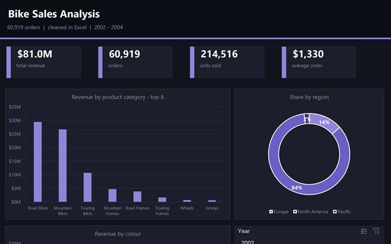</a> 
<b>$81.0M</b> revenue · <b>60,919</b> orders <b>83%</b> of revenue from bikes 
  
<a href="https://github.com/RAKAN-A-ALNUSAYRI/data-analysis-projects/tree/main/bike-sales-analysis">View project →</a>
</td>
<td width="50%" valign="top">
 <b><a href="https://github.com/RAKAN-A-ALNUSAYRI/data-analysis-projects/tree/main/supply-chain-performance">Supply Chain Performance</a></b> 
5,000 orders, 3 suppliers, 3 years — where do the delays and the losses really come from? 
<a href="https://github.com/RAKAN-A-ALNUSAYRI/data-analysis-projects/tree/main/supply-chain-performance">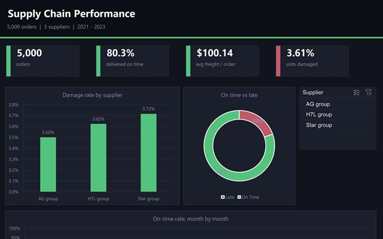</a> 
<b>80.3%</b> on time · <b>3.61%</b> damaged <b>$100.14</b> average freight 
  
<a href="https://github.com/RAKAN-A-ALNUSAYRI/data-analysis-projects/tree/main/supply-chain-performance">View project →</a>
</td>
</tr>
<tr>
<td width="50%" valign="top">
 <b><a href="https://github.com/RAKAN-A-ALNUSAYRI/data-analysis-projects/tree/main/city-profitability-analysis">City Profitability</a></b> 
26,397 sales lines on a star schema — is the biggest city really the most profitable? 
<a href="https://github.com/RAKAN-A-ALNUSAYRI/data-analysis-projects/tree/main/city-profitability-analysis">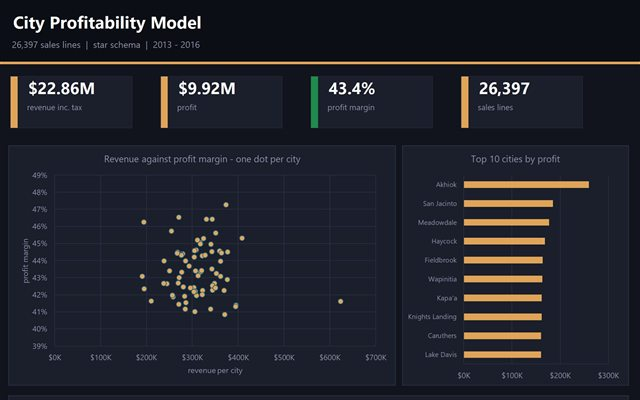</a> 
<b>$22.86M</b> revenue · <b>$9.92M</b> profit <b>43.4%</b> overall margin 
   
<a href="https://github.com/RAKAN-A-ALNUSAYRI/data-analysis-projects/tree/main/city-profitability-analysis">View project →</a>
</td>
<td width="50%" valign="top">
 <b><a href="https://github.com/RAKAN-A-ALNUSAYRI/data-analysis-projects/tree/main/cookie-sales-analysis">Cookie Sales Report</a></b> 
A Power BI report on orders, products and customers — and the concentration risk it exposes. 
<a href="https://github.com/RAKAN-A-ALNUSAYRI/data-analysis-projects/tree/main/cookie-sales-analysis">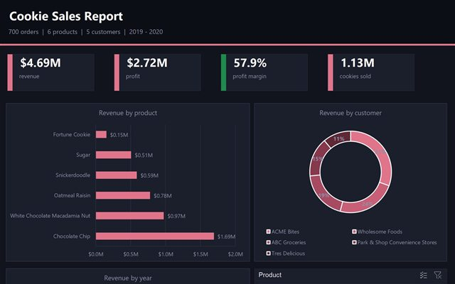</a> 
<b>$4.69M</b> revenue · <b>57.9%</b> margin <b>54%</b> from 2 of 5 buyers 
   
<a href="https://github.com/RAKAN-A-ALNUSAYRI/data-analysis-projects/tree/main/cookie-sales-analysis">View project →</a>
</td>
</tr>
</table>

</td>
<td width="34%" valign="top">

<h3> Technology Stack</h3>

<a href="https://www.python.org/">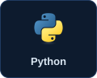</a>  <a href="https://numpy.org/">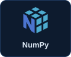</a> 
<a href="https://en.wikipedia.org/wiki/SQL">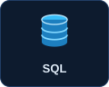</a> <a href="https://scikit-learn.org/">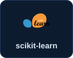</a> <a href="https://matplotlib.org/">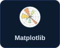</a> 
<a href="https://seaborn.pydata.org/">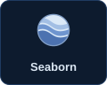</a> <a href="https://www.microsoft.com/power-platform/products/power-bi">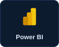</a> <a href="https://git-scm.com/">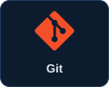</a> 
 <a href="https://jupyter.org/">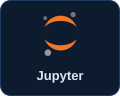</a> <a href="https://fastapi.tiangolo.com/">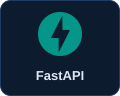</a>

<h3> Recent Activity</h3>

<picture>
  <source media="(prefers-color-scheme: dark)" srcset="./dist/github-contribution-grid-snake-dark.svg">
  <source media="(prefers-color-scheme: light)" srcset="./dist/github-contribution-grid-snake.svg">
  
</picture>

<a href="https://github.com/RAKAN-A-ALNUSAYRI?tab=overview">More activity on GitHub →</a>

<h3> Foundations &amp; Learning</h3>

 <a href="https://github.com/RAKAN-A-ALNUSAYRI/python-foundations"><b>python-foundations</b></a> <code>Public</code> 
Core Python concepts and practice projects  
 <a href="https://github.com/RAKAN-A-ALNUSAYRI/data-science-foundations"><b>data-science-foundations</b></a> <code>Public</code> 
Analysis, visualization and machine-learning basics  
 <a href="https://github.com/RAKAN-A-ALNUSAYRI/data-analysis-projects"><b>data-analysis-projects</b></a> <code>Public</code> 
Real-world analyses and case studies

<a href="https://github.com/RAKAN-A-ALNUSAYRI?tab=repositories">See all →</a>

</td>
</tr>
</table>

<h2> About Me · نبذة عني</h2>

<blockquote>
<i>"Turning data into insight, and insight into action."</i>
</blockquote>

I'm <b>Rakan Alnusayri</b> — a <b>Computer Science graduate</b> based in <b>Riyadh, Saudi Arabia</b> 🇸🇦, focused on <b>data analysis</b> and <b>machine learning</b>.

I work at the intersection of <b>data analysis</b>, <b>data science</b>, and <b>machine learning</b> — turning messy, real-world data into clear decisions with <b>SQL</b>, <b>Python</b>, and <b>Power BI</b>, and taking it further with <b>machine-learning models</b> that solve practical problems.

 

 

<h2> Let's Connect</h2>

I'm open to focused conversations around AI, data science, practical projects, and future opportunities.

<table>
<tr>
<td width="25%" align="center"> <b><a href="https://www.linkedin.com/in/rakan-alnusayri-1100b72ab">LinkedIn</a></b> Professional Network &amp; Career</td>
<td width="25%" align="center"> <b><a href="https://github.com/RAKAN-A-ALNUSAYRI">GitHub</a></b> Code Projects &amp; Repositories</td>
<td width="25%" align="center"> <b><a href="https://rakan-a-alnusayri.github.io/portfolio/">Portfolio</a></b> Work Case Studies &amp; Design</td>
<td width="25%" align="center"> <b><a href="mailto:rakanalnsyry8@gmail.com">Email</a></b> Direct Collaborations</td>
</tr>
</table>

Build · Learn · Share · Improve · Repeat 
📍 Riyadh, Saudi Arabia   Let's build a brighter tomorrow.

